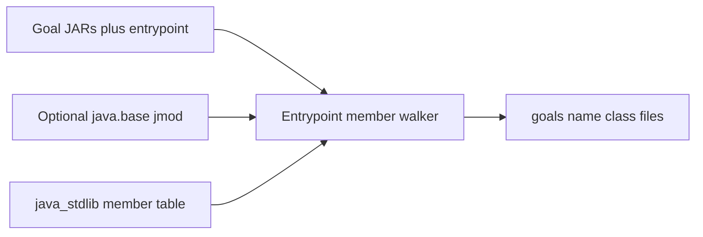
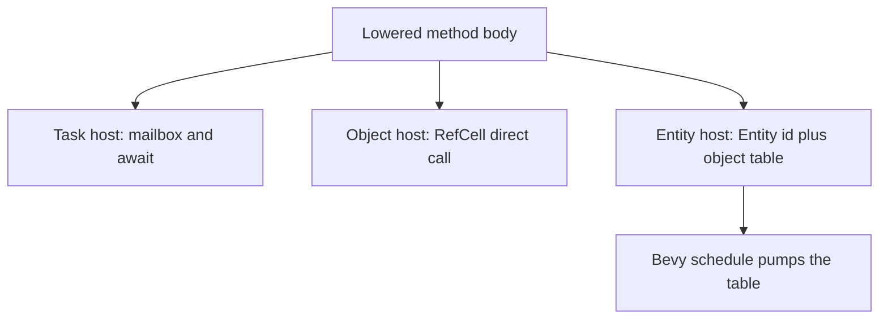

# Inventory, Bevy host seam, and Minecraft backlog

Status: `jars-inventory`, the task/object/entity host seam, and the headless
`jars-bevy` host are in the tree. `goals/minecraft/` is the worklist for
Prism Launcher's Minecraft 26.3 client (`net/minecraft/client/main/Main`),
generated with the local library JARs and Temurin 21 jmods. The walker follows
callees, concrete overrides, and `invokedynamic` method handles, so the
worklist includes the LWJGL OpenGL and Vulkan members reached from Blaze3D
and RenderPearl. The client JAR and jmods are inputs and are not vendored.

The inventory walker parses class files directly. It does not call
`select_jar_programs`, because that importer rejects unmodeled platform classes
and native methods that have no `Code` attribute.

## Decisions

- **Builtin** means a referenced platform member (`java/`, `javax/`, `jdk/`, `sun/`, `com/sun/`) that belongs in [`crates/jars-stdlib/src/lib.rs`](crates/jars-stdlib/src/lib.rs) (`java_stdlib!`). **Native** means a referenced member with `ACC_NATIVE` (`0x0100`) and no `Code` attribute, including JDK natives and native-binding libraries on the goal classpath (for example LWJGL). Classification needs an optional platform classpath (a `java.base` jmod or JAR). Without it, every platform member is recorded as a builtin and natives stay unclassified.
- The default generated host stays the current mailbox **task** model ([`Spawner`](crates/jars-runtime/src/lib.rs), `FuturesUnordered`, lock only around one state access). **Object** and **entity** hosts are explicit alternatives. That keeps the actor rule in [`AGENTS.md`](AGENTS.md) for the default emitter.
- Bevy does not store Java fields as exclusively borrowed components. Java calls are re-entrant; a Bevy `World` query is not. An entity is an identity. Instance state lives in a host table the schedule owns, and methods are ordinary direct calls into that table. The Bevy app only pumps the schedule.
- The Minecraft client JAR is an input path, never a vendored artifact. What gets checked in is the API worklist. JDK call sites keep real names even when game classes are obfuscated, so the backlog does not need mappings.

## 1. Inventory script

`jars-inventory` sits beside [`jars-triage`](crates/jars-core/src/bin/jars-triage.rs) and [`jars-coverage`](crates/jars-core/src/bin/jars-coverage.rs). It reuses `read_jar_classpath` and walks the entrypoint member closure, then records member references that closure actually executes.

`add_member_dependencies` stops at the owning class for `java/…` and `program_dependencies` never emits `name` + descriptor. The inventory walker keeps `(owner, name, descriptor, opcode)` for `invokestatic`, `invokevirtual`, `invokeinterface`, `invokespecial`, and field refs. Platform class files are parsed only to read `access_flags` and the presence of `Code`. A jmod adapter strips the `classes/` prefix; those classes are never selected for lowering.

Each item is one of:

- `done` — exact owner/name/descriptor already in the `java_stdlib!` table ([`member`](crates/jars-core/src/stdlib.rs)). Finished members are omitted from the open files.
- `blocked` — closed-world gap: `invokedynamic`, method handles, or reflection/class-loading (`Class.forName`, `Method.invoke`, and the same family). Listed so the gap is visible, not offered as an implementation task. Kind stays `native` or `builtin`; `reason = "closed-world"` is extra.
- `native` or `builtin` — still open

Checked-in layout, deterministic and diffable:

- `goals/<name>/index.toml` — goal name, entrypoint, target release, counts, classes sorted by reference count
- `goals/<name>/<class>.toml` — one file per open class, members sorted by descriptor, reference count, kind (`native` or `builtin`), and `blocked` reason when set. `/` in the binary name becomes `.` (`java/lang/System` is `java.lang.System.toml`).

Regeneration recomputes `done` from the stdlib table so finished work drops out of the open files, and deletes stale `*.toml` files. `blocked` reasons stay derived too. A fixture test builds a tiny JAR that calls one unmodeled `java/` method and one `ACC_NATIVE` method, plus a stub platform JAR, and asserts the two files and their kinds. No Minecraft bytes are in that test.

## 2. Host seam, then Bevy

Method bodies stay closed-world Rust. Only addressing, state, and cross-object calls change. Emission is monomorphic: one `ObjectModel` on the compile path (`Task` default, `Object`, `Entity`). A single generic that is both `async` and synchronous does not fit Rust, and the templates bake in `.await` inside `static_method`, `instance_method`, `actor_code`, and `static_state_code`.

- **Task** (default): `Program<S: Spawner>`, mailbox, `async fn`, `.await` at each cross-object call.
- **Object**: `Rc<RefCell<State>>` handle, plain `fn` returning `JavaResult`. Borrow the cell only around a field read or write, and drop it before a nested call (same discipline as not holding the mutex across `.await`).
- **Entity**: same synchronous calls. The handle is a Bevy `Entity`. State lives in an object table. `jars-bevy` owns the table and a headless schedule runner. Generated entity programs depend on `jars-bevy`; task and object programs do not. `Program` holds the static `RefCell` and is inserted with `insert_non_send`, because the table's `Rc` is not `Send`.

`JavaArray` and `JavaStringBuilder` have synchronous twins selected by the same model. Virtual calls stay closed-world matches on the receiver type. Direct dynamic dispatch means that match calls the method function, instead of enqueueing `ActorRef::send`.

The proof is `AddFactory`, which prints `42`, compiled as task and as object with identical output, plus one headless Bevy run (`default-features = false`, no window) that boots `Program`, constructs one instance entity, and checks the same output. Static initialization stays on the program context.

## 3. Minecraft stretch goal

Point `jars-inventory` at a local client JAR and a local `java.base` jmod. The entrypoint is whatever `main` that jar actually contains (official or obfuscated); JDK and LWJGL descriptors come from the constant pool either way. Commit the generated `goals/minecraft/` tree. Do not commit the JAR, jmod, or decompiled game source.

Each open class file is one subtask. An agent implements that class's open members in `java_stdlib!` (builtins) or as runtime native shims (natives), then regenerates so those members leave the open set. `blocked` entries are not subtasks. This pass does not try to run the game, link GLFW, or replace Minecraft's loop with Bevy; the entity host is only proven on the small fixture.

The command is in [`goals/minecraft/README.md`](../goals/minecraft/README.md).
